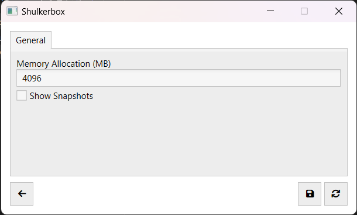

#  Shulkerbox

A simple Minecraft launcher!

## ⚒️ Usage

1. Download the latest package from the [releases page](https://github.com/dentolos19/Shulkerbox/releases)
2. Extract the package and run `Shulkerbox.exe`
3. Launch the game
4. Done!

## ⚙️ Features

> **Note**: Most of this feature set has been made possible with [CmlLib.Core](https://github.com/CmlLib/CmlLib.Core)!

- [X] Supports offline authentication
- [X] Easily manage your accounts
- [X] Launch any Minecraft version (tested up to 1.19.2)
- [X] Downloads files from the official Mojang file server
- [X] Automatically installs the Java runtime

## 📸 Screenshots

