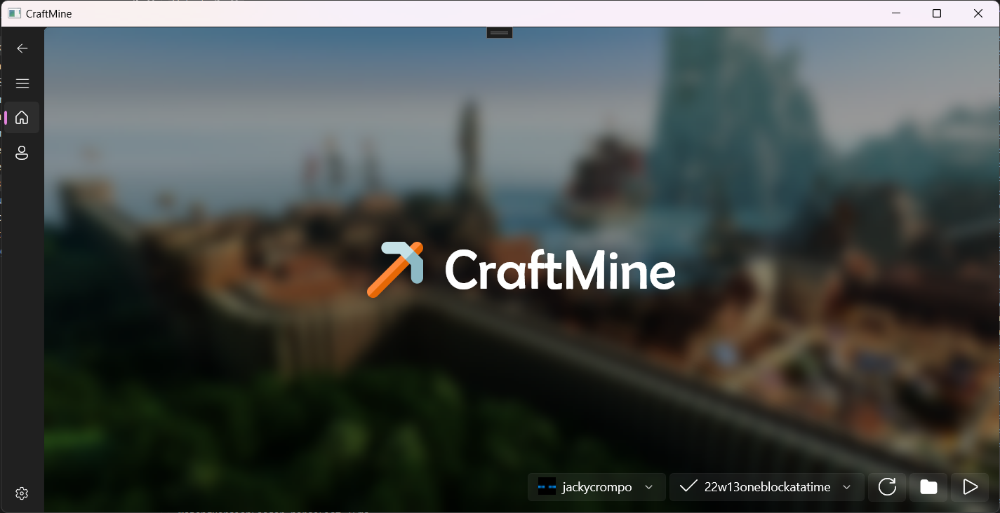
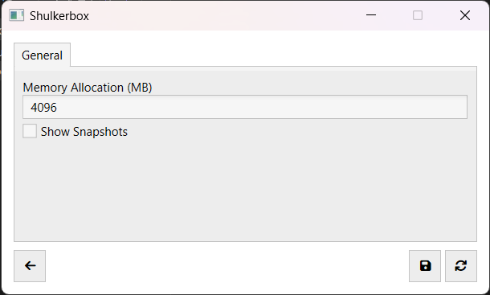
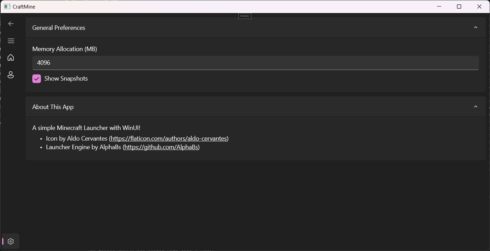

#  Shulkerbox

A simple Minecraft Launcher with WinUI!

## Usage

1. Download the latest package from the [releases page](https://github.com/dentolos19/CraftMine/releases) compatible with your system
3. Follow this [documentation](https://docs.microsoft.com/dotnet/maui/windows/deployment/overview#installing-the-app) for installation
4. Done!

## Features

> **Note**: Most of this feature set has been made possible with [CmlLib.Core](https://github.com/CmlLib/CmlLib.Core)!

- [X] Supports offline authentication
- [X] Easily manage your accounts
- [X] Launch any Minecraft version (tested up to 1.19.2)
- [X] Downloads files from the official Mojang file server
- [X] Automatically installs the Java runtime

## Images

