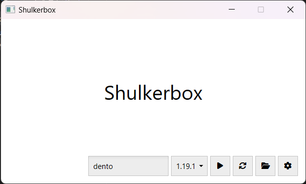

#  CraftMine

A simple Minecraft Launcher with WinUI!

## Features

> **Note**: This feature set has been made possible with [CmlLib.Core](https://github.com/CmlLib/CmlLib.Core)!

- [X] Supports offline authentication
- [X] Launch any Minecraft version (tested up to 1.19.2)
- [X] Downloads files from the official Mojang file server
- [X] Automatically installs the Java runtime

## Images

