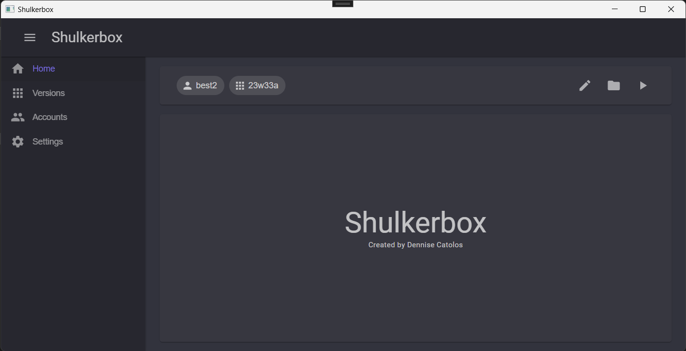
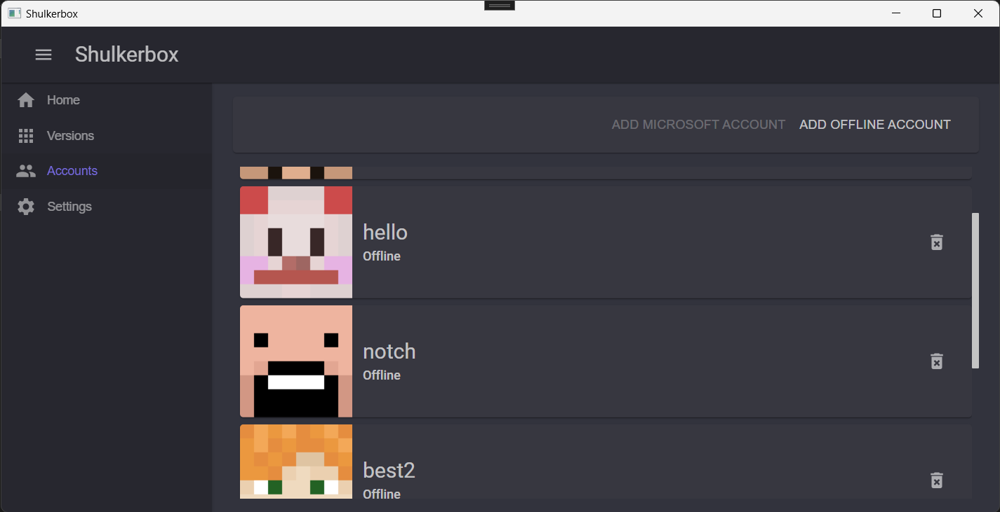

#  Shulkerbox

A simple Minecraft launcher with WinUI!

## ⚒️ Usage

1. Download the latest package from the [releases page](https://github.com/dentolos19/Shulkerbox/releases)
2. Follow this [documentation](https://learn.microsoft.com/dotnet/maui/windows/deployment/publish-cli?view=net-maui-7.0#installing-the-app) for installation
3. Done!

## ⚙️ Features

> **Note**: Most of this feature set has been made possible with [CmlLib.Core](https://github.com/CmlLib/CmlLib.Core)!

- [x] Supports offline authentication
- [x] Easily manage your accounts
- [x] Launch any Minecraft version (tested up to 1.19.2)
- [x] Downloads files from the official Mojang file server
- [x] Automatically installs the Java runtime

## 📸 Screenshots

