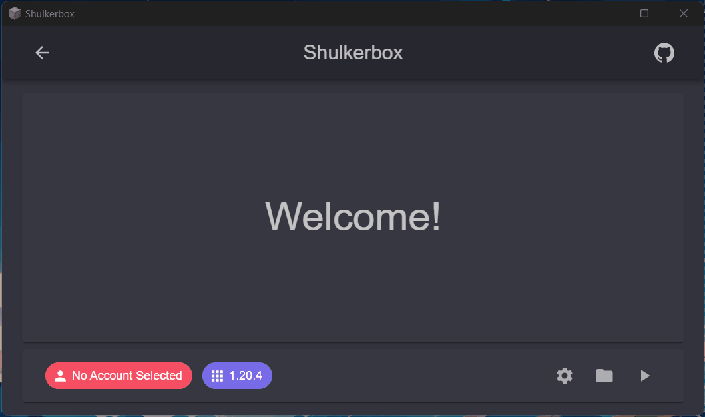

<h1>
    
    Shulkerbox
</h1>

A simple Minecraft launcher built on Blazor Hybrid!

## ⚒️ Usage

Go check out [the wiki](https://github.com/dentolos19/Shulkerbox/wiki) to learn how to install this app!

## ⚙️ Features

> **Note**: Most of this feature set has been made possible with [CmlLib.Core](https://github.com/CmlLib/CmlLib.Core)!

- [x] Supports Windows and Linux
- [x] Supports offline authentication
- [x] Easily manage your accounts
- [x] Easily download Fabric, Quilt and LiteLoader versions
- [x] Launch any Minecraft version (tested up to `1.20.4`)
- [x] Downloads files from Mojang's official CDN
- [x] Automatically installs the Java runtime

### Roadmap

- [ ] Support Microsoft authentication
- [ ] Support macOS

## 📜 License

Distributed under the MIT License. See [LICENSE](./LICENSE) for more information.